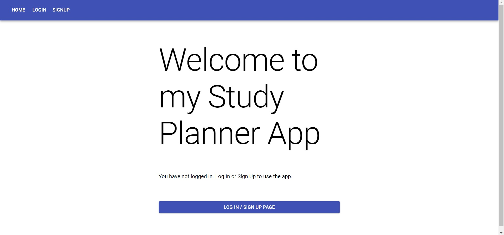

# study-planner-app
Creating a full stack CRUD application using Flask and React

Used Flask as the backend and React for the frontend.
Backend supports user login functionality by using Flask-JWT-Extended

React Frontend

Originally React serves to port 3000. Has a proxy to port 5000 if it cant find the route.
Flask serves to port 5000.